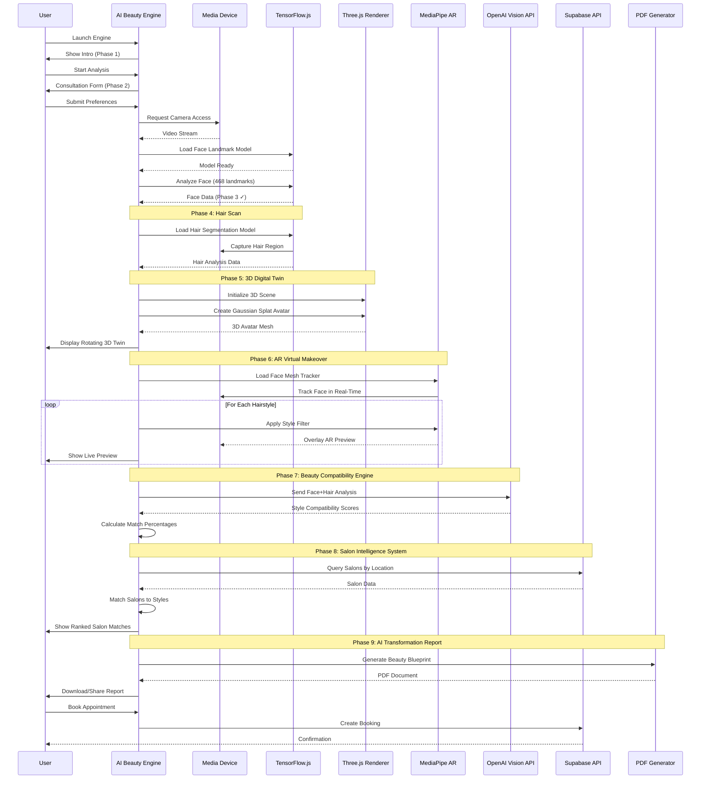

# Design Document: AI Beauty Intelligence Engine™

## Overview

The AI Beauty Intelligence Engine™ is a full-screen immersive experience that transforms traditional salon search into an AI-powered beauty transformation journey. The system uses advanced computer vision (TensorFlow.js with 468+ facial landmarks), 3D rendering (Three.js with Gaussian Splats), AR virtual try-on (MediaPipe Face Mesh), and AI-powered beauty compatibility scoring to provide users with personalized hairstyle, makeup, and salon recommendations.

**Current Status**: Phases 1-3 complete (Intro, Consultation, Face Scan). This design covers the remaining 6 phases: Hair Scan, 3D Digital Twin, AR Virtual Makeover, Beauty Compatibility Engine, Salon Intelligence System, and AI Transformation Report.

**Key Innovation**: The engine combines real-time facial analysis with predictive beauty intelligence to match users with optimal styles and expert salons, generating a downloadable AI Beauty Blueprint PDF report with compatibility scores, before/after visualizations, and booking recommendations.

## Main Algorithm/Workflow



## Architecture

### System Components

The AI Beauty Intelligence Engine consists of the following major components:

1. **Camera Module**: Manages media device access and video stream capture
2. **Face Analysis Engine**: TensorFlow.js-based facial landmark detection (468 points)
3. **Hair Segmentation Engine**: Computer vision model for hair region detection and color analysis
4. **3D Rendering Engine**: Three.js with Gaussian Splat technology for avatar generation
5. **AR Overlay Engine**: MediaPipe Face Mesh for real-time virtual try-on
6. **Compatibility Scoring Engine**: OpenAI Vision API integration for style matching
7. **Salon Intelligence Engine**: Location-based salon matching with expertise scoring
8. **Report Generator**: PDF generation system for AI Beauty Blueprint
9. **Booking Integration**: Connection to salon booking system

### Component Interactions

- **Camera → Face Analysis**: Raw video frames flow to TensorFlow.js for landmark detection
- **Face Analysis → 3D Rendering**: Facial landmarks generate mesh for Gaussian Splat avatar
- **Camera + AR Overlay**: Real-time face tracking enables virtual hairstyle previews
- **Face + Hair Analysis → Compatibility Engine**: Combined biometric data sent to OpenAI for scoring
- **Compatibility Scores + Location → Salon Intelligence**: Matches user profile with salon expertise
- **All Analysis Data → Report Generator**: Aggregates results into downloadable PDF

## Data Structures

### FaceAnalysisData
```typescript
interface FaceAnalysisData {
  landmarks: {
    x: number;
    y: number;
    z: number;
  }[];
  faceShape: 'oval' | 'round' | 'square' | 'heart' | 'diamond' | 'long';
  skinTone: string; // Hex color code
  facialFeatures: {
    eyeShape: string;
    eyeColor: string;
    lipShape: string;
    noseShape: string;
  };
  confidence: number; // 0-1
  timestamp: number;
}
```

### HairAnalysisData
```typescript
interface HairAnalysisData {
  color: string; // Hex color code
  length: 'short' | 'medium' | 'long';
  texture: 'straight' | 'wavy' | 'curly' | 'coily';
  density: 'thin' | 'medium' | 'thick';
  segmentationMask: ImageData;
  confidence: number; // 0-1
  timestamp: number;
}
```

### DigitalTwinModel
```typescript
interface DigitalTwinModel {
  meshData: Float32Array;
  gaussianSplatData: {
    positions: Float32Array;
    colors: Uint8Array;
    scales: Float32Array;
    rotations: Float32Array;
  };
  textureMap: string; // Base64 encoded
  animationRig: object;
}
```

### StyleCompatibilityScore
```typescript
interface StyleCompatibilityScore {
  styleId: string;
  styleName: string;
  compatibilityScore: number; // 0-100
  reasoning: string;
  visualPreviewUrl: string;
  confidence: number; // 0-1
  tags: string[];
}
```

### SalonMatch
```typescript
interface SalonMatch {
  salonId: string;
  salonName: string;
  matchScore: number; // 0-100
  expertiseMatch: string[];
  location: {
    address: string;
    distance: number;
    coordinates: { lat: number; lng: number };
  };
  availability: {
    nextAvailable: string; // ISO date
    slots: string[];
  };
  pricing: {
    estimatedCost: number;
    currency: string;
  };
  rating: number;
  reviewCount: number;
}
```

### AIBeautyBlueprint
```typescript
interface AIBeautyBlueprint {
  userId: string;
  generatedAt: string; // ISO date
  faceAnalysis: FaceAnalysisData;
  hairAnalysis: HairAnalysisData;
  topStyles: StyleCompatibilityScore[];
  recommendedSalons: SalonMatch[];
  beforeAfterPreviews: {
    before: string; // Image URL
    after: string; // Image URL
    styleId: string;
  }[];
  pdfUrl: string;
}
```

## Phase 4: Hair Scan Implementation

### Objective
Analyze user's hair characteristics using computer vision to enable accurate style matching.

### Technical Approach
1. **Model Loading**: Load TensorFlow.js hair segmentation model (BodyPix or custom model)
2. **Segmentation**: Identify hair region pixels from video frame
3. **Color Analysis**: Extract dominant hair color from segmented region
4. **Texture Detection**: Analyze hair pattern to classify texture
5. **Metadata Extraction**: Determine length, density, and volume characteristics

### Acceptance Criteria
- Hair segmentation mask achieves >85% accuracy on diverse hair types
- Color extraction completes within 500ms
- Texture classification handles straight, wavy, curly, and coily patterns
- System gracefully handles edge cases (hats, headbands, no hair visible)

## Phase 5: 3D Digital Twin Generation

### Objective
Create a realistic 3D avatar of the user's face using Gaussian Splat technology.

### Technical Approach
1. **Mesh Construction**: Convert 468 facial landmarks into 3D mesh vertices
2. **Gaussian Splatting**: Apply 3D Gaussian Splat rendering for photorealistic appearance
3. **Texture Mapping**: Apply captured skin tone and features to mesh surface
4. **Animation Rigging**: Enable head rotation and expression capabilities
5. **WebGL Rendering**: Display interactive 3D model in browser using Three.js

### Acceptance Criteria
- Mesh generation completes within 2 seconds
- Avatar achieves photorealistic quality (subjective, but should match reference images)
- 3D model supports 360-degree rotation at 60 FPS
- Texture resolution maintains facial feature clarity
- Model file size stays under 5MB for performance

## Phase 6: AR Virtual Makeover

### Objective
Overlay virtual hairstyles and makeup in real-time on user's camera feed.

### Technical Approach
1. **Face Tracking**: Use MediaPipe Face Mesh for continuous face detection
2. **Coordinate Mapping**: Map hairstyle assets to facial landmarks
3. **Lighting Adjustment**: Match virtual overlay lighting to camera environment
4. **Style Library**: Load pre-rendered hairstyle and makeup assets
5. **Real-Time Rendering**: Maintain 30+ FPS overlay performance

### Acceptance Criteria
- Face tracking maintains lock with <50ms latency
- Overlay follows head movements smoothly (no jitter)
- Library includes minimum 20 hairstyle options
- Users can cycle through styles in <1 second per switch
- System handles different lighting conditions

## Phase 7: Beauty Compatibility Engine

### Objective
Use AI to score style compatibility based on facial features and user preferences.

### Technical Approach
1. **Data Preparation**: Package face and hair analysis into structured prompt
2. **OpenAI Vision Integration**: Send analysis + style images to GPT-4 Vision API
3. **Scoring Algorithm**: Request compatibility percentage with reasoning
4. **Batch Processing**: Score multiple styles in parallel
5. **Result Caching**: Store scores to avoid redundant API calls

### Acceptance Criteria
- Compatibility scores range from 0-100 with explanations
- API response time <3 seconds per style
- System batches multiple style requests efficiently
- Scores remain consistent across multiple runs for same input
- Edge cases (API failure) handled with fallback scoring

## Phase 8: Salon Intelligence System

### Objective
Match users with salons that specialize in their recommended styles.

### Technical Approach
1. **Location Query**: Retrieve user's location (permission-based)
2. **Salon Database Search**: Query Supabase for nearby salons
3. **Expertise Matching**: Filter salons by style specialization tags
4. **Scoring Algorithm**: Rank salons by match quality, rating, distance
5. **Availability Check**: Display real-time booking slots

### Acceptance Criteria
- Search radius configurable (default 25 miles)
- Results ranked by weighted score (50% expertise, 30% rating, 20% distance)
- Minimum 3 salon matches returned (if available in region)
- Salon data includes pricing, availability, portfolio images
- Users can filter results by price range and rating

## Phase 9: AI Transformation Report Generation

### Objective
Generate a comprehensive PDF report summarizing analysis and recommendations.

### Technical Approach
1. **Data Aggregation**: Collect all analysis results (face, hair, styles, salons)
2. **Template Rendering**: Populate PDF template with user data
3. **Visualization**: Include before/after AR previews, compatibility charts
4. **Personalization**: Add user name, date, custom branding
5. **Export Options**: Enable download and email delivery

### Acceptance Criteria
- PDF generation completes within 5 seconds
- Report includes all analysis sections (face, hair, styles, salons)
- Before/after images embedded at high resolution (min 800px width)
- PDF file size optimized (<3MB)
- Download and email share options functional

## Error Handling

### Camera Access Errors
- **Scenario**: User denies camera permission
- **Handling**: Display clear instructions to enable camera in browser settings
- **Fallback**: Allow photo upload as alternative input method

### Model Loading Failures
- **Scenario**: TensorFlow.js or MediaPipe models fail to load
- **Handling**: Show loading progress bar with retry option
- **Fallback**: Degrade gracefully to manual feature selection form

### API Failures
- **Scenario**: OpenAI API timeout or rate limit
- **Handling**: Retry with exponential backoff (3 attempts)
- **Fallback**: Use rule-based compatibility scoring algorithm

### Poor Lighting Conditions
- **Scenario**: Camera feed too dark or overexposed
- **Handling**: Display real-time lighting quality indicator
- **Guidance**: Prompt user to adjust lighting before proceeding

### No Salons Found
- **Scenario**: No salons match criteria in user's area
- **Handling**: Expand search radius automatically
- **Fallback**: Suggest online consultation booking options

## Performance Requirements

- **Page Load**: Initial load <3 seconds on 4G connection
- **Model Loading**: All ML models loaded within 5 seconds
- **Face Analysis**: Landmark detection at 30 FPS minimum
- **3D Rendering**: Avatar display at 60 FPS
- **AR Overlay**: Real-time preview at 30 FPS minimum
- **API Response**: Compatibility scoring <3 seconds per style
- **PDF Generation**: Complete within 5 seconds
- **Memory Usage**: Stay under 500MB browser memory
- **Bundle Size**: JavaScript bundle <2MB (gzipped)

## Security & Privacy

- **Camera Data**: All processing happens client-side; no video uploaded to server
- **Biometric Storage**: Facial landmark data encrypted before optional cloud save
- **User Consent**: Explicit opt-in required for data storage
- **Data Retention**: Analysis data deleted after 30 days unless user opts to save
- **Third-Party APIs**: Only send anonymized, aggregated data to OpenAI
- **GDPR Compliance**: Full data export and deletion capabilities

## Browser Compatibility

- **Chrome**: 90+ (recommended)
- **Safari**: 14+ (WebRTC support required)
- **Firefox**: 88+ (WebGL 2.0 required)
- **Edge**: 90+
- **Mobile**: iOS Safari 14+, Chrome Mobile 90+

## Dependencies

### Core Libraries
- `@tensorflow/tfjs@4.x` - Machine learning models
- `@tensorflow-models/face-landmarks-detection@1.x` - Face detection
- `@mediapipe/face_mesh@0.4.x` - AR face tracking
- `three@0.160.x` - 3D rendering
- `@react-three/fiber@8.x` - React Three.js integration
- `@react-three/drei@9.x` - Three.js helpers

### Supporting Libraries
- `openai@4.x` - OpenAI API client
- `jspdf@2.x` - PDF generation
- `html2canvas@1.x` - Screenshot capture for report
- `@supabase/supabase-js@2.x` - Backend API

### Development Dependencies
- `@types/three@0.160.x` - TypeScript definitions
- `vite@5.x` - Build tool
- `vitest@1.x` - Testing framework


## Correctness Properties

*A property is a characteristic or behavior that should hold true across all valid executions of a system—essentially, a formal statement about what the system should do. Properties serve as the bridge between human-readable specifications and machine-verifiable correctness guarantees.*

### Property 1: Hair Segmentation Accuracy

*For any* diverse set of face images with known hair regions, the hair segmentation accuracy SHALL exceed 85 percent across different hair types, lighting conditions, and camera angles.

**Validates: Requirement 1.2**

### Property 2: Hair Color Extraction Performance

*For any* valid hair segmentation mask, color extraction SHALL complete within 500 milliseconds regardless of hair region size or complexity.

**Validates: Requirement 1.3**

### Property 3: Hair Classification Correctness

*For any* hair image with known characteristics, classification SHALL correctly identify texture (straight, wavy, curly, coily) and length (short, medium, long).

**Validates: Requirements 1.4, 1.5**

### Property 4: Confidence Score Validity

*For any* hair analysis result, the confidence score SHALL always be a valid number between 0 and 1 inclusive.

**Validates: Requirement 1.7**

### Property 5: Mesh Generation Performance

*For any* valid facial landmark array containing 468 points, mesh generation SHALL complete within 2 seconds.

**Validates: Requirement 2.1**

### Property 6: 3D Model Size Constraint

*For any* generated 3D digital twin model, the file size SHALL be less than 5 megabytes.

**Validates: Requirement 2.5**

### Property 7: Texture Mapping Completeness

*For any* mesh and texture input, the output 3D model SHALL contain applied texture data mapped to the mesh surface.

**Validates: Requirement 2.3**

### Property 8: Face Tracking Latency

*For any* face movement in the video stream, the AR overlay position update SHALL occur with less than 50 milliseconds latency.

**Validates: Requirement 3.3**

### Property 9: AR Rendering Performance

*For any* AR overlay rendering scenario, the system SHALL maintain at least 30 frames per second during real-time preview.

**Validates: Requirements 3.6, 8.5**

### Property 10: Style Switching Performance

*For any* pair of hairstyle assets in the library, switching from one style to another SHALL complete in less than 1 second.

**Validates: Requirement 3.7**

### Property 11: Lighting Adaptation

*For any* detectable lighting condition change in the camera feed, the AR overlay lighting parameters SHALL adjust to match the environment.

**Validates: Requirement 3.9**

### Property 12: Compatibility Prompt Structure

*For any* face and hair analysis data, the generated prompt for OpenAI API SHALL contain all required fields (facial features, hair characteristics, style reference).

**Validates: Requirement 4.1**

### Property 13: Compatibility Score Validity

*For any* compatibility scoring result (from API or fallback), the score SHALL be an integer between 0 and 100 inclusive and include explanatory reasoning text.

**Validates: Requirement 4.4**

### Property 14: Parallel Processing Efficiency

*For any* set of N styles (N > 1), processing them in parallel SHALL complete faster than sequential processing.

**Validates: Requirement 4.5**

### Property 15: Scoring Idempotence

*For any* identical input (face data, hair data, style), scoring multiple times SHALL return the same compatibility score (via caching).

**Validates: Requirements 4.6, 4.9**

### Property 16: API Retry Behavior

*For any* OpenAI API failure, the system SHALL retry the request exactly 3 times with exponential backoff timing (1s, 2s, 4s).

**Validates: Requirements 4.7, 7.7**

### Property 17: Salon Filtering Correctness

*For any* set of salons and recommended style specialization tags, filtered results SHALL only include salons whose specialization tags match at least one recommended style tag.

**Validates: Requirement 5.3**

### Property 18: Salon Ranking Formula

*For any* set of filtered salons, the ranking order SHALL follow the weighted formula: 0.5 × expertise_score + 0.3 × rating_score + 0.2 × distance_score (normalized).

**Validates: Requirement 5.4**

### Property 19: Salon Result Minimum

*For any* region with N available salons, the system SHALL return min(3, N) salon matches.

**Validates: Requirement 5.5**

### Property 20: Salon Data Completeness

*For any* salon in the result set, the output SHALL include all required fields: pricing, availability, portfolio images, and rating.

**Validates: Requirement 5.6**

### Property 21: Salon Filtering by Criteria

*For any* salon result set and filter criteria (price range or rating threshold), applying the filter SHALL return only salons matching the criteria.

**Validates: Requirement 5.9**

### Property 22: Report Data Aggregation

*For any* complete analysis session, report aggregation SHALL include all four data components: face analysis, hair analysis, style scores, and salon matches.

**Validates: Requirement 6.1**

### Property 23: Report Image Size

*For any* generated AI Beauty Blueprint PDF, before and after AR preview images SHALL have a minimum width of 800 pixels.

**Validates: Requirement 6.3**

### Property 24: Report Visualization Presence

*For any* generated report, the PDF SHALL contain both compatibility score chart visualizations and style comparison visualizations.

**Validates: Requirement 6.4**

### Property 25: Report Personalization

*For any* user report, the PDF SHALL include the user's name, generation date timestamp, and custom branding elements.

**Validates: Requirement 6.5**

### Property 26: PDF Generation Performance

*For any* valid report data, PDF generation SHALL complete within 5 seconds.

**Validates: Requirements 6.6, 8.7**

### Property 27: PDF File Size Optimization

*For any* generated PDF, the file size SHALL be less than 3 megabytes after optimization.

**Validates: Requirement 6.7**

### Property 28: Report Completeness

*For any* downloadable AI Beauty Blueprint, the PDF SHALL contain all defined sections: face analysis summary, hair analysis summary, top style recommendations, and recommended salon list.

**Validates: Requirement 6.9**

### Property 29: Lighting Quality Detection

*For any* camera frame input, the lighting quality indicator SHALL produce a measurable quality score reflecting the lighting conditions.

**Validates: Requirement 7.5**

### Property 30: Face Analysis Frame Rate

*For any* face video stream during analysis, landmark detection SHALL maintain a minimum of 30 frames per second.

**Validates: Requirement 8.3**

### Property 31: 3D Rendering Frame Rate

*For any* 3D digital twin avatar during rotation, the rendering SHALL maintain 60 frames per second.

**Validates: Requirements 2.4, 8.4**

### Property 32: Memory Usage Constraint

*For any* user session with the AI Engine active, browser memory consumption SHALL remain below 500 megabytes.

**Validates: Requirement 8.8**

### Property 33: Video Processing Client-Side Only

*For any* video frame processing operation, network monitoring SHALL show zero video data uploaded to servers.

**Validates: Requirement 9.1**

### Property 34: Biometric Data Encryption

*For any* facial landmark data being stored, the stored data SHALL be encrypted before being written to storage.

**Validates: Requirement 9.2**

### Property 35: Data Anonymization for API

*For any* payload sent to OpenAI API, the data SHALL contain no personally identifiable information (PII) such as names, email addresses, or user IDs.

**Validates: Requirement 9.5**

### Property 36: Data Export Completeness

*For any* user requesting data export, the exported file SHALL include all stored data associated with that user: face analysis, hair analysis, style scores, and salon matches.

**Validates: Requirement 9.6**

### Property 37: Continuous Face Tracking

*For any* video stream with a face present, the AR face tracking SHALL continuously produce landmark updates without gaps exceeding 100 milliseconds.

**Validates: Requirement 3.2**
